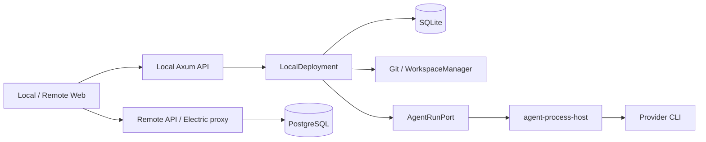

# システム境界と起動順序

EVK は、作業要求を管理する画面と、実際のファイル・Git・coding agent を動かすホストを組み合わせる。ローカルサーバーの `DeploymentImpl` は現在 `LocalDeployment` に固定されている。Remote は同じ型の差し替え実装ではなく、独立したサーバーである。[型の結線](../../crates/server/src/lib.rs#L9-L12)、[workspace 境界](../../Cargo.toml#L1-L36)

## 責任の配置

| 境界 | 所有する責任 |
| --- | --- |
| `server` | HTTP/WS の入力検証、製品操作、Workflow と Repository Memory の接続 |
| `deployment` / `local-deployment` | 共通サービスの要求面と、ローカルの DB・実行・Git・preview・relay の組み立て |
| `executors` / process host | provider 固有通信と、実行・監査の仕組み |
| `workflow` / server runtime | グラフの純粋な検証・計画と、永続状態・外部効果を伴う実行 |
| `remote` | 認証付きの共同作業データと同期 API |
| Web の shell / `web-core` | 実行環境ごとの接続設定と共有製品画面 |

サービスの結線は [LocalDeployment](../../crates/local-deployment/src/lib.rs#L57-L89)と [Deployment trait](../../crates/deployment/src/lib.rs#L79-L129)が入口になる。Workspace の「container」はこのサービス上の作業環境を指す。ファイル所有権と Git の隔離は [Workspace](../concepts/workspace.md)で確認する。

## 永続化は一つではない

ローカル DB は asset directory の `db.v2.sqlite` を開き、SQLx migration を適用する。通常 pool は DELETE journal と 5 秒の busy timeout を使う。[DB 初期化](../../crates/db/src/lib.rs#L254-L268)、[timeout の理由](../../crates/db/src/lib.rs#L12-L15)

Remote は PostgreSQL pool、migration、Electric 用 role/publication を準備してから認証・サービスを組み立てる。ローカル DB とクラウド DB は別の所有境界である。[Remote 起動](../../crates/remote/src/app.rs#L33-L58)から [Web と同期](web-and-sync.md)へ進むと、同じ Issue 画面がどちらを読むかを追える。

Git の作業木、Native Audit、Repository Memory は SQLite と別の永続状態を持つ。復旧で DB の状態だけを正しいと決めず、[実行ホスト](agent-runtime.md)や [記憶の統合状態](../concepts/repository-memory.md)の証拠も確認する。

新しい [単一サーバーコンテナー](../operations/server-container.md)は、この local application を Linux サーバーで動かす配布形態である。Remote の PostgreSQL / Electric 系を立ち上げるものではない。nginx の認証・preview origin、実行環境と永続 volume の境界は同ページに置く。[配布の適用範囲](../../docs/self-hosting/server-container.mdx#what-the-image-contains)

## 起動時は内側の所有者から回復する

standalone の `main.rs` と Tauri が使う `startup.rs` の両方に回復経路がある。

1. Deployment を構築し、実際の provider host の所有・接続を回復する。
2. 中断した bootstrap を fence してから、耐久化された direct command を再処理する。
3. Setup launch gate を照合する。
4. orchestration の outbox/inbox/lease、続いて Workflow を照合する。
5. 最後に OpenWiki の製品回復 monitor を開始する。

この順序は、複数の回復主体が同じ実行を進めることを避けるためにコードで明示されている。古い ExecutionProcess の孤児処理を新しい AgentRun へ流用すると、生きたプロセスを誤判定し得る。[standalone](../../crates/server/src/main.rs#L87-L137)、[embedded](../../crates/server/src/startup.rs#L170-L225)

Deployment の構築中には、DB 初期化後に既存の製品実行記録から [Workspace の用途](../concepts/workspace.md#操作用途と実行所有者)を backfill する。[呼出し](../../crates/local-deployment/src/lib.rs#L155-L156)。standalone は bootstrap fence に続いて中断した Integration preparation も fence し、OpenWiki monitor の次に [正式 Integration](../concepts/formal-integration.md) の monitor を開始する。一方、現行 embedded の対応箇所にはこの二つの Integration 呼出しがない。両起動経路で正式統合の自動進行が同じと仮定せず、desktop 対応を変更する際に確認する。[standalone の追加処理](../../crates/server/src/main.rs#L87-L137)、[embedded の現行配線](../../crates/server/src/startup.rs#L170-L225)

standalone は main と preview proxy に別 listener を作り、`BACKEND_PORT`、次に `PORT`、未指定なら OS の空き port を使う。既定 host は `127.0.0.1`。embedded の `start()` は `localhost:0` を使い、hostname と IPv6 接続の不一致を避ける理由が記録されている。[standalone listener](../../crates/server/src/main.rs#L146-L171)、[embedded listener](../../crates/server/src/startup.rs#L107-L142)

## 境界を変更するとき

API 型は Rust から TypeScript へ生成するため、Rust と Web の変更を一組として評価する。ルートの Rust workspace は `remote` と `relay-tunnel` を除外している。「workspace の検証成功」を全サーバーの検証成功と読み替えない。[型生成の入口](../../crates/server/src/bin/generate_types.rs#L642-L663)、[開発・検証](../operations/development.md)
