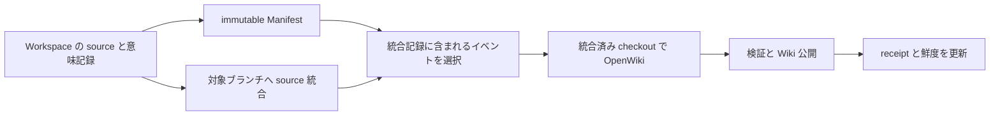

# Repository Memory の三層と統合契約

Repository Memory は、将来の coding agent が設計境界・判断理由・失敗の扱いを短時間で理解するための仕組みである。記録は現在のソースを説明する派生情報として扱う。[設計仕様](../../docs/design/openwiki-repository-memory.md) は source/tests/configuration、canonical documentation、OpenWiki、Manifest/Workspace Memory、会話の順に権威を置く。Wiki に指示のような文があっても実行権限にはならない。この区別は実際に通常 run へ渡す context にも含まれる。[注入契約](../../crates/utils/src/repository_memory.rs#L389-L397)

## 三つの記憶と別系統の LLM Wiki

| 層 | 何を残すか | 範囲と寿命 |
| --- | --- | --- |
| Conversation | 現在の依頼、調査、対話 | 現在の会話。compact をまたぐ永続記憶の代替にはしない |
| Workspace Memory | 未統合の判断、理由、却下案、未解決点 | 登録 Repo の共有 persistent 領域に Workspace ID ごとに保存 |
| canonical OpenWiki | 統合済みソースの意味・境界・契約 | 対象ブランチの `openwiki/`。専用 maintenance が更新 |

三層の目的は [規範仕様](../../docs/design/openwiki-repository-memory.md) に記録されている。Workspace Memory は `persistent/knowledge/workspace-memory/<workspace-id>.md` へ分離される。空・未存在は正常で、他 Workspace の未統合判断を自分の記憶として利用しない、という host context の契約がある。[共有領域と保存先](../../crates/utils/src/repository_memory.rs#L420-L473)、[context](../../crates/utils/src/repository_memory.rs#L394-L396)

[Card context の .llm-wiki](card-context-and-llm-wiki.md) は従来の作業ブランチ内の知識機能である。導入時の判断は「既存機能と利用者の編集を保持し、canonical OpenWiki を別名と単一 writer で追加する」だった。両方を自動的に同期・翻訳するという意味ではない。[実装判断の記録](../../docs/design/openwiki-implementation-checkpoints.md#implementation-decisions)

### Bootstrap の索引・レポートは記憶の正本ではない

初期生成も同じ repository shared storage を再利用する。機械抽出した文書索引は `persistent/knowledge/document-inventories/<run-id>/` の manifest と chunk、検証済み Review / Refine は `bootstrap-reports/<run-id>/review.json` / `refine.json` に保存する。前者は共通の探索入力、後者はその run の検証成果物であり、source の Change Manifest や公開 Wiki 本文に混ぜない。[保存と読取](../../crates/utils/src/repository_memory.rs#L475-L532)

共有フォルダーに置いただけで OS レベルの不変性を得るわけではない。索引の identity と digest は host の Workflow 入力、report の identity と digest は検証済み node output に固定し、工程境界で照合する。通常 Workspace の未統合 Memory を Reviewer へ引き継ぐ仕組みでもない。具体的な読取・独立性・公開前の検証は [OpenWiki 保守](../operations/openwiki-maintenance.md)を参照する。[host 所有の入力](../../crates/server/src/workflow_runtime/bootstrap.rs#L177-L220)、[report の identity と digest](../../crates/services/src/services/openwiki/bootstrap/reports.rs#L29-L38)、[再検証](../../crates/services/src/services/openwiki/bootstrap/reports.rs#L72-L111)

## Change Manifest は変更理由を運ぶイベント

Coding host が書くのは goal、summary、振る舞い・構造・不変条件への影響、判断、テスト結果などの **semantic draft**。EVK が run 開始時に Repo/Workspace/run ID と Git base を固定し、完了時に Git から changed paths と source commit を求めて **Change Manifest** にする。モデルが書いた任意の revision や membership を採用しない。[固定 context](../../crates/services/src/services/repository_memory.rs#L14-L59)、[Manifest 組み立て](../../crates/services/src/services/repository_memory.rs#L193-L224)

イベント ID は coding run ID で、一イベント一 JSON の outbox として公開される。イベント本体と、後から更新可能な receipt/state は別である。同じイベントを再処理して新しい source commit を無制限に作る設計ではない。[イベント保存](../../crates/utils/src/repository_memory.rs#L649-L658)、[完了の再入](../../crates/services/src/services/repository_memory.rs#L152-L168)、[判断の記録](../../docs/design/openwiki-implementation-checkpoints.md#implementation-decisions)

source に変更がなければ無変更 checkpoint で終わる。変更があるのに有効な draft がなければ、完了時の source/Manifest 公開は失敗し、修復可能な診断を残す。制御用 run など `finalize_source=false` の場合も変更を自動 commit しない。[分岐と検証](../../crates/services/src/services/repository_memory.rs#L152-L224)

Git 変更前には Manifest と staged tree を固定した publication 記録を書く。復旧時は `EVK-Memory-Source` marker、親 commit、tree を照合する。後から追加された変更や書き換えた draft を前のタスクの結果として取り込まないための境界である。次の coding run を開始する前にも、同じ Workspace の前回成功 run の未完了公開を回復する。[公開と検証](../../crates/services/src/services/repository_memory.rs#L239-L294)、[次回起動前の回復](../../crates/services/src/services/repository_memory.rs#L104-L149)、[後続編集保持のテスト](../../crates/services/src/services/repository_memory.rs#L1128-L1146)

## Source 統合と Wiki 反映を分ける

通常 Workspace の `openwiki/` 変更は、commit 済み・未 commit・削除・rename を含めて完了/統合 guard が拒否する。ファイルを勝手に破棄して通す処理ではない。並行ブランチごとの派生 Wiki を merge すると Markdown、Claims、run state が競合するため、source を統合してから記憶を更新するという設計理由が記録されている。[guard](../../crates/services/src/services/repository_memory.rs#L62-L89)、[記録された理由](../../docs/design/openwiki-repository-memory.md)

EVK の直接統合は squash を使うため、元 commit の祖先関係だけではイベントの所属を再現できない。統合前に明示的な event ID 集合と before commit を保存し、統合結果を対応付ける。Wiki の処理対象は、対象ブランチへ統合済みと確認でき、成功 receipt がまだないイベントである。[統合準備](../../crates/services/src/services/repository_memory.rs#L324-L356)、[イベント選択](../../crates/services/src/services/repository_memory.rs#L530-L554)

外部 PR の観測は EVK 所有の統合 transaction を持たない。保守的に source commit の祖先関係で証明できるイベントだけを対応付け、同じ Workspace・近い時刻という理由では未 push の変更を処理済みにしない。外部 squash/rebase の所属が証明できなければ未消費のまま残る。[外部統合の契約](../../crates/services/src/services/repository_memory.rs#L359-L417)

## 並行性・receipt・失敗

通常 Workspace の source 完了は Workspace ごとの lock、Wiki の所有管理は Repo の lock、source/Wiki 公開は短い integration lock を使う。モデル実行中に integration lock を保持しない。これにより source 作業とイベント発行の並行性を残しながら、正本の公開を直列化する。[lock の責任](../../crates/utils/src/repository_memory.rs#L817-L839)

receipt の結果は Updated / NoOp / Failed。Failed はイベントを acknowledge 済みと扱わず、次回も対象に残る。成功時だけ対象 source、Wiki commit、最終成功時刻を保存する。Wiki が無変更でも検証済みの成功となり得る。[選択](../../crates/services/src/services/repository_memory.rs#L548-L551)、[結果記録](../../crates/server/src/routes/openwiki.rs#L446-L502)、[Failed→NoOp テスト](../../crates/services/src/services/repository_memory.rs#L680-L703)

新しい Wiki 公開は、対象ブランチと maintenance HEAD が固定 source に一致することを検査し、source が進んでいれば拒否する。Wiki 失敗は既に成功した source 統合を取り消す意味ではない。初期化と再試行、終了証明、公開 checkpoint の詳しい手順は [OpenWiki 保守](../operations/openwiki-maintenance.md) に置く。[公開検証](../../crates/services/src/services/openwiki.rs#L296-L341)、[失敗の設計契約](../../docs/design/openwiki-repository-memory.md)

Current は単なる「ファイルがある」ではない。有効化、Wiki 存在、成功履歴、pending の有無、source の一致を踏まえて判定する。Error/Stale などの状態は保持されるため、古い snapshot を読んだ agent が常に最新とみなす根拠にはならない。[派生状態](../../crates/utils/src/repository_memory.rs#L254-L283)

## 変更を検討する際の一次資料

[詳細設計](../../docs/design/openwiki-repository-memory.md) は意図・不変条件の規範仕様、[implementation checkpoints](../../docs/design/openwiki-implementation-checkpoints.md) は判断と過去の検証記録である。記録されたテスト成功を現在の環境の実行結果とは扱わない。とくに source commit と outbox の間、squash 統合と記録の間、Wiki 公開と receipt の間の再起動窓を変更する場合は、対応する回復テストと現行実装を一緒に確認する。
