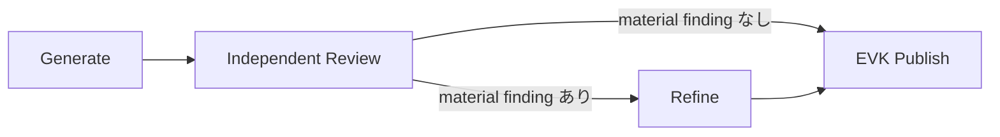

# OpenWiki の初期生成・同期・回復

OpenWiki maintenance は、統合済みソースから canonical Wiki を更新する専用作業である。通常の coding Workspace が生成する Change Manifest、Source checkpoint、receipt の意味は [Repository memory](../concepts/repository-memory.md) に集約する。ここでは、その入力を Wiki に反映する実行と回復を扱う。

## 開始条件と通常 Sync

Repository settings で有効化し、統合先の **local branch** と出力言語を選ぶ。開始処理は未解決の source integration を拒否し、未処理 event の統合 commit が選択 branch に入っていることを確認する。remote branch 自体を公開先にはできない。必要な source が未取得なら model を開始せずエラーにする。[開始前の検証](../../crates/server/src/routes/openwiki.rs#L172-L217)

準備された root に openwiki/index.md がなければ Bootstrap、あれば通常 Sync を選ぶ。通常 Sync は一つの Codex Session / AgentRun による reconciliation であり、Bootstrap の独立 Review を毎回実行するものではない。[分岐](../../crates/server/src/routes/openwiki.rs#L283-L313)

利用手順と依存条件は [OpenWiki repository memory](../../docs/workspaces/openwiki.mdx) を参照する。文書は pinned OpenWiki と Node.js 22 以上、既存 Codex 認証を用いる構成を定める。EVK の version 検査は CLI の help banner を読み、固定版との完全一致を要求する。--version が exit 0 になるだけでは互換性の確認にならない。[利用条件](../../docs/workspaces/openwiki.mdx)・[version 検査](../../crates/services/src/services/openwiki.rs#L104-L136)

EVK の準備処理は public Codex integration を --force なしで準備する。変更された user 設定を上書きせず conflict とする方針が code comment に記録されている。maintenance thread は public MCP の `openwiki mcp --host codex` を必須として設定し、turn / Goal 開始前に実際の lifecycle tool catalog を確認する。[準備境界](../../crates/services/src/services/openwiki.rs#L139-L155)・[thread 設定](../../crates/executors/src/executors/codex.rs#L929-L956)・[起動前確認](../integrations/agent-providers.md#coding-agent--外部-mcp-server)

## Bootstrap の phase と所有権

Bootstrap は repository scope の system Workflow で、Issue / WorkflowAttempt を作る通常実行と区別される。専用 Workspace と開始 source を共有し、phase ごとに新しい Session と AgentRun を使う。global template を書き換えず run の graph を予約する。[設計上の区別](../../docs/design/openwiki-bootstrap-implementation.md#compatibility-decisions)・[予約](../../crates/server/src/workflow_runtime/bootstrap.rs#L96-L162)・[fresh Session の検証](../../crates/server/src/workflow_runtime/bootstrap.rs#L278-L304)

| Phase | 役割と完了条件 |
| --- | --- |
| Generate | init を開始し、その run の finish=complete を証明する。完了後の明確な矛盾は任意の強制 update で修正できる |
| Review | 独立した source 探索と Wiki coverage 確認。JSON の finding と verdict を返し、host が全文を検証・保存する |
| Refine | finding ごとに独立証拠で fixed / refuted / already_satisfied を説明する。fixed は完了した強制 update が必要 |
| Publish | EVK が phase 結果・source・復元済み instructions・Wiki-only 変更を検証し、既存公開処理を実行する |

[phase 検証](../../crates/server/src/workflow_runtime/bootstrap.rs#L460-L600)・[Publish の検証](../../crates/server/src/workflow_runtime/bootstrap.rs#L603-L651)

Repository owner は phase 間も維持される。既存の repository recovery monitor が lock 下で進め、普通の Workflow watcher が独立して進行させない。[進行の境界](../../crates/server/src/workflow_runtime/bootstrap.rs#L657-L658) 実装する scheduler と outbox の関係は [Workflow Runtime](../architecture/workflow-runtime.md) を参照する。

## 共通文書索引は探索の入口であって網羅性証明ではない

host は固定した source SHA の Git 追跡ファイルから、Generate dispatch 前に一度だけ文書索引を作る。保存済み graph と実 dispatch の両方に、同じ run の参照と短い利用指示を渡す。共有するのはファイルの所在・形式・静的見出し・原文行位置であり、Generator の選別・解釈・計画ではない。保存先と記憶層との区別は [Repository Memory](../concepts/repository-memory.md#bootstrap-の索引レポートは記憶の正本ではない)を参照する。[前処理と graph](../../crates/server/src/workflow_runtime/bootstrap.rs#L118-L156)、[dispatch 時の読込](../../crates/server/src/workflow_runtime/bootstrap.rs#L271-L272)

`docs/` に限定せず文書候補を列挙し、生成 `openwiki/`、既存の常時除外ディレクトリ、setup byproduct は含めない。AGENTS.md / CLAUDE.md は `instruction_only` として区別し、symlink・submodule を辿らない。Markdown / MDX 以外の対応文書もファイル単位で存在を残す。[候補と除外](../../crates/services/src/services/openwiki/inventory.rs#L310-L331)、[各ファイルの分類](../../crates/services/src/services/openwiki/inventory.rs#L354-L405)

Markdown と静的 MDX は `markdown-rs` の MDAST を使う。原文 snapshot と worktree の内容が一致する場合だけ見出し位置を載せる。MDX の JSX 内にある Markdown 見出しは解析対象だが、ESM import や式がある場合はファイル全体を理由付き `file_only` とし、JavaScript・repository の設定・プラグインを実行しない。巨大ファイル・位置不一致・解析失敗・見出しなしも、消さずに理由を記録する。これは動的な描画結果の索引ではない。[内容照合](../../crates/services/src/services/openwiki/inventory.rs#L379-L402)、[parser と静的文字列](../../crates/services/src/services/openwiki/inventory.rs#L408-L482)

対象 snapshot に `.openwikiignore` がある場合、0.5.1 の互換な公開選別 API がないため **索引利用不可** として従来の独立探索へ戻る。独自 matcher で代用せず、件数不明を候補ゼロとも扱わない。snapshot と worktree の ignore が不一致なら失敗する。[ignore 判定](../../crates/services/src/services/openwiki/inventory.rs#L124-L153)、[利用不可の通知](../../crates/services/src/services/openwiki/inventory.rs#L271-L282)

索引は manifest と番号付き chunk から成り、host の `workflow_runs.input_text` に identity・digest を固定する。dispatch 前・各 child 完了時・publication 前に全 chunk を検証し、欠落・改変・別 run の参照を拒否する。Agent の書込禁止は指示と工程境界での検知であり、完全な OS 隔離や途中変更後の復元を検出する保証ではない。[host 入力](../../crates/server/src/workflow_runtime/bootstrap.rs#L177-L214)、[全体検証](../../crates/services/src/services/openwiki/inventory.rs#L238-L307)、[完了時](../../crates/server/src/workflow_runtime/bootstrap.rs#L465-L468)、[公開前](../../crates/server/src/workflow_runtime/bootstrap.rs#L603-L608)

両 Agent は manifest と全 chunk を分割して読み、必要な原資料と source を独立に調べる契約を持つ。候補ゼロでも通常の Generate / Review を続ける。索引の作成完了、Agent の読取、Wiki の意味的網羅性は別であり、名前やリンクがあるだけで coverage を満たしたとは扱わない。重要な未確認領域は既存の summary に残す。[役割別の利用指示](../../crates/services/src/services/openwiki/inventory.rs#L271-L282)

## Writer の操作と完了証拠

writer は同じ root host で begin → plan → next_page → ページ執筆 → submit_page を順に進め、全 page 完了後に finish する。EVK は公開 MCP の呼び出し開始・完了を Native Audit から照合する。同時 call、開始記録のない完了、別 root thread の writer、食い違う重複結果は拒否する。[認められる tool と直列性](../../crates/services/src/services/openwiki/completion.rs#L143-L215)

登録済み MCP が利用不能なとき、自作の shell / stdio / SDK bridge で別プロセスを起動して代用しない。正しく Markdown を生成できても、その経路では EVK が必要とする native MCP call event を証明できないためである。host prompt は迂回せず連携エラーを報告するよう要求し、起動前の tool discovery で早期に確認する。[host の契約](../../crates/services/src/services/openwiki.rs#L180-L190)、[事前確認の実装](../../crates/executors/src/executors/codex/client/openwiki.rs#L25-L89)

Bootstrap での重要な規則は次の通り。

- Generate は **この phase 内で完了した init** を必要とする。begin-noop は初期生成の完了証拠にならない。
- init 完了後の修正と Refine の執筆は update + force=true を使う。新しい init で修正しない。
- page / finish の recoverable validation error は同じ active run 内で訂正できる。開始した run が未完了なら、後の成功で隠せない。
- finish は status=complete を必要とし、sourceChanged=true を拒否する。成功した強制 update に Git diff は必須ではない。

[完了必須](../../crates/services/src/services/openwiki/completion.rs#L116-L140)・[finish と再 begin](../../crates/services/src/services/openwiki/completion.rs#L219-L315)・[diff 不要の記録](../../docs/design/openwiki-bootstrap-implementation.md#phase-completion-contract)

EVK は最新 attempt だけでなく、AgentRun の全 RunAttempt を順番に読み、identity、終了、audit integrity、時間的な重複を確認する。各 attempt の root thread は、その attempt 自身の thread start/resume 応答で束縛する。missing audit は「何もしなかった」の証明にはならない。[DB と audit の照合](../../crates/server/src/routes/openwiki/completion.rs#L19-L125)・[root の束縛](../../crates/services/src/services/openwiki/completion.rs#L68-L113)

最新 attempt の terminal 投影と process-exit 登録が競合する場合だけ、spawned/running の登録を最大10秒未満の pending として再観測する。古い未終了 attempt や unreachable host にはこの猶予を与えない。[終了待ち](../../crates/server/src/routes/openwiki/completion.rs#L57-L83)・[focused test](../../crates/server/src/routes/openwiki/completion.rs#L373-L394)

通常 Sync の証明は別の HostReconciliationProof で、verified begin-noop または finish-complete を受け入れる。Bootstrap の全 attempt 契約を、そのまま通常 Sync の実装済み保証と解釈しない。[Sync の証拠](../../crates/server/src/routes/openwiki.rs#L357-L387)

## 独立 Review と finding の解決

Review は generator の会話や upstream Workflow context を受け取らない。Codex thread は read-only、OpenWiki MCP / Skill は無効化され、共有 user 設定を変更しない。開始前の dirty worktree を内容 fingerprint として保存し、完了時に同一性を確認する。「Review 開始時に Git diff が空」であることは要求しない。[独立性の意図](../../docs/workspaces/openwiki.mdx)・[thread isolation](../../crates/executors/src/executors/codex.rs#L912-L928)・[baseline](../../crates/server/src/workflow_runtime/bootstrap.rs#L312-L318)・[変更検出](../../crates/server/src/workflow_runtime/bootstrap.rs#L512-L533)

CoverageReview は version 1 の閉じた JSON。material finding が一つでもある場合に限り `needs_refinement` と一致させ、minor だけで Refine を起動しない。**指摘件数の quota や、通常 Workflow の12,000文字 handoff に収める制約はない**。prompt / JSON schema は件数・項目長の上限を示さず、根拠のある独立した不足を省略しないよう要求する。一方、host は資源防御として JSON 全体の1 MiB超過を parse 前に拒否する。これは執筆目標ではなく、超過時に勝手に切り詰めて PASS にする処理もない。[parse と verdict](../../crates/services/src/services/openwiki/bootstrap.rs#L13-L94)、[Reviewer 指示](../../crates/services/src/services/openwiki/bootstrap.rs#L409-L421)

Reviewer はファイルを書かず、最終 JSON を返す。host が検証後に全文を共有 report へ保存し、node output は source/run/Session/AgentRun/phase identity、digest、verdict と件数の小さな参照にする。Refiner の実 dispatch はこの凍結ファイルの path を渡し、全 finding を分割読取させる。PASS でも publication 前に Review を再検証し、REFINE では処置結果も再検証する。改変・欠落を新しいファイルで隠して進めない。[保存](../../crates/server/src/workflow_runtime/bootstrap.rs#L504-L533)、[Refiner 入力](../../crates/server/src/workflow_runtime/bootstrap.rs#L320-L332)、[publication 再検証](../../crates/server/src/workflow_runtime/bootstrap.rs#L441-L457)

RefinementReport の findingIndex は frozen Review の0始まり index。全 material finding に一つずつ resolution が必要で、未知・重複 index は拒否する。各 resolution に独立した source/doc evidence を要求し、fixed / already_satisfied には Wiki page path も要る。Wiki 自身、生成 instructions、symlink や存在しない file を独立証拠として通さない。[report の検証](../../crates/services/src/services/openwiki/bootstrap.rs#L155-L238)

Refine が update を行わず全 material finding を refuted / already_satisfied とすることもできる。その場合は setup 復元後の fingerprint が Review baseline と同じでなければならない。[update と変更の関係](../../crates/server/src/workflow_runtime/bootstrap.rs#L570-L595)

生成・レビュー・更新の品質基準は「重要概念・契約・通常操作の説明先が安定し、初見の読者が断片を再構成せず理解できること」。概念ページ、横断 workflow、実装 architecture は異なる問いを扱い、詳細契約の正本を一か所へ置いて本文中の意味あるリンクで結ぶ。固定ディレクトリ・最低ページ数・一名詞一ページは要求しない。Generate だけに架空製品の構成例を渡し、Review はその形への準拠ではなく開発判断に影響する不足を評価する。通常 Sync も既存の説明先と関連リンクを維持する。[共通原則](../../crates/services/src/services/openwiki.rs#L20-L24)、[計画例と Review](../../crates/services/src/services/openwiki/bootstrap.rs#L397-L418)、[Sync](../../crates/services/src/services/openwiki.rs#L170-L175)

schema、path、operation の検査が証明するのは構造と監査上の閉包であり、推論の正しさや repository 全体の意味的網羅ではない。実装記録もこの限界を明記する。[検証の限界](../../docs/design/openwiki-bootstrap-implementation.md)

## 公開・復元・失敗回復

agent phase は source HEAD を動かさない。EVK は phase 境界で setup journal から元の instructions を復元する。復元前後に予期しない編集を検出すると、その内容を保全して失敗する。journal がない場合に元内容を推測して再生成しない。[復元](../../crates/services/src/services/openwiki/setup.rs#L126-L183)

公開候補は user-authored openwiki/INSTRUCTIONS.md の一致を検証し、upstream setup byproduct を除外、canonical Wiki 以外の変更を拒否する。AGENTS.md / CLAUDE.md の生成 setup を writer が途中で手動復元する運用ではなく、host 終了後の EVK の責務である。[公開候補の検査](../../crates/services/src/services/openwiki.rs#L200-L246) 公開 checkpoint と source drift の詳細は [Repository memory の統合・公開](../concepts/repository-memory.md) を参照する。

失敗・取消・server 再起動のとき、Bootstrap は CleaningUp に入り、新しい有料 phase を自動再開しない。通常の監査付き Cancel を送信し、残存 active run がなくなってから instructions を復元し、Workflow を Failed にして owner を解放する。Stop 要求を送っただけで所有権を消してはいけない。[cleanup](../../crates/server/src/workflow_runtime/bootstrap.rs#L818-L909)・[再起動時の fence](../../crates/server/src/workflow_runtime/bootstrap.rs#L943-L959)・[未終了 child を保持する test](../../crates/server/src/workflow_runtime/bootstrap_tests.rs#L450-L520)

既に durable publication checkpoint がある場合は、その Git 公開と receipt だけを回復する。途中の model phase を再実行して別成果物を重ねる回復ではない。ユーザー向けの状況確認は Repository settings と View Workflow の Canvas / Dashboard、失敗修正後は新しい Bootstrap が入口となる。[運用手順](../../docs/workspaces/openwiki.mdx)・[checkpoint 回復](../../docs/workspaces/openwiki.mdx)

## 設計文書の読み方

[Bootstrap v2](../../docs/design/openwiki-bootstrap-workflow-v2.md) が基本の設計、[implementation record](../../docs/design/openwiki-bootstrap-implementation.md) が phase completion の一部を明示的に更新した記録である。後者は「最後の mode だけで判断」「Refine は必ず操作する」という旧前提を置き換える。source の PhaseCompletionProof と対応して読む。

回帰検証の入口は、[全 attempt の audit を検査する test](../../crates/server/src/routes/openwiki/completion.rs#L398-L438) と、[Generate self-correction / 操作なし Refine の test](../../crates/server/src/routes/openwiki/completion.rs#L352-L369)。これらは model 呼び出しなしの protocol fixture であり、意味的 coverage の保証と混同しない。
